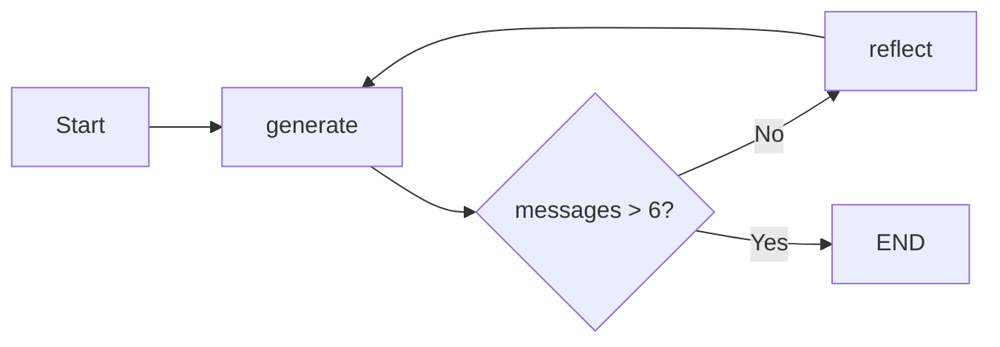

# LangChain Course - LangGraph Reflection Agent Branch

## Overview

This branch implements a **Reflection Agent** using **LangGraph** that iteratively improves content through a generate-reflect loop pattern.

## Purpose

Demonstrate the reflection agent pattern:

- **Self-critique loop** for iterative content improvement
- **StateGraph** with generate and reflect nodes
- **Conditional iteration** based on message count
- **Prompt engineering** for generation and reflection

## Features

### Reflection Loop (`main.py`)

Creates a graph that alternates between generation and reflection:

```python
builder = StateGraph(state_schema=MessageGraph)
builder.add_node(GENERATE, generation_node)
builder.add_node(REFLECT, reflection_node)
builder.add_conditional_edges(GENERATE, should_continue, {END: END, REFLECT: REFLECT})
builder.add_edge(REFLECT, GENERATE)
```

### Custom State Schema

Uses TypedDict with message accumulation:

```python
class MessageGraph(TypedDict):
    messages: Annotated[list[BaseMessage], add_messages]
```

### Dual Chain Architecture (`chains.py`)

Two specialized prompts for different roles:

- **Generation Chain**: Twitter influencer writing posts
- **Reflection Chain**: Critic providing feedback and recommendations

```python
generate_chain = generation_prompt | llm  # Content creator
reflect_chain = reflection_prompt | llm   # Content critic
```

## Execution Flow



## File Structure

```
├── main.py        # LangGraph reflection flow
├── chains.py      # Generation and reflection chains
├── flow.png       # Generated graph visualization
├── pyproject.toml
└── .env
```

## Key Design Decisions

1. **Iterative Refinement**: Multiple generate-reflect cycles for quality improvement
2. **Message Count Termination**: Stops after 6+ messages (3 iterations)
3. **Role Separation**: Distinct personas for generation vs critique
4. **HumanMessage for Feedback**: Reflection output wrapped as user message

## Getting Started

1. Install dependencies:

   ```bash
   uv sync
   ```

2. Configure `.env`:

   ```
   OPENAI_API_KEY=your_key
   ```

3. Run the agent:
   ```bash
   python main.py
   ```

## Example Output

Input: A rough tweet draft about LangChain
Output: Progressively refined tweet through 3 iterations of critique and improvement

## Differences from Other Branches

| Compared To                | Difference                                |
| -------------------------- | ----------------------------------------- |
| `langgraph-agent-executor` | Reflection loop vs tool execution loop    |
| `react-search-agent`       | Self-improvement vs information retrieval |
| `search-agent`             | Content generation vs search tasks        |
