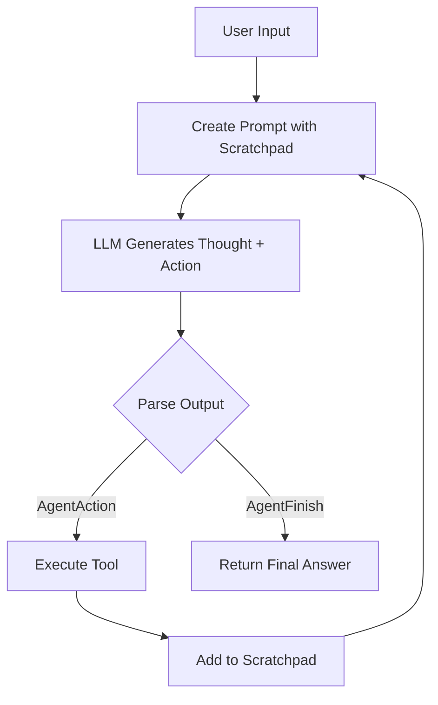

# LangChain Course - Agent Executor Search Agent Branch

## Overview

This branch implements a **ReAct (Reason + Act) agent** using LangChain's output parser and manual execution loop with detailed scratchpad management.

## Purpose

Demonstrate the complete ReAct agent pattern:

- Custom **ReAct prompt template** with structured format
- **ReActSingleInputOutputParser** for parsing agent output
- **Scratchpad management** for tracking intermediate steps
- **Stop sequences** to control LLM generation

## Features

### ReAct Prompt Template

Structured prompt format with clear action/observation cycle:

```
Thought: you should always think about what to do
Action: the action to take, should be one of [{tool_names}]
Action Input: the input to the action
Observation: the result of the action
... (repeat N times)
Thought: I now know the final answer
Final Answer: the final answer
```

### Output Parser

Uses `ReActSingleInputOutputParser` to parse LLM text into:

- `AgentAction`: Tool name and input to execute
- `AgentFinish`: Final answer when done

### Scratchpad (intermediate_steps)

Maintains history of (action, observation) pairs:

```python
intermediate_steps.append((agent_step, str(observation)))
```

### Stop Sequences

```python
llm = ChatOpenAI(
    stop=["\nObservation", "Observation"],  # Stop before observation
)
```

## File Structure

```
├── main.py        # ReAct agent implementation
├── callbacks.py   # Callback handler for logging
├── pyproject.toml
└── .env
```

## Key Design Decisions

1. **Manual Execution Loop**: Full control over ReAct cycle
2. **Text-Based Parsing**: Uses regex-based output parsing vs structured JSON
3. **Stop Sequences**: Prevent LLM from hallucinating observations
4. **Format Log to String**: `format_log_to_str()` converts steps to readable text

## Agent Execution Flow



## Differences from Other Branches

| Compared To                 | Difference                                            |
| --------------------------- | ----------------------------------------------------- |
| `tool-calling-search-agent` | Uses ReAct text format vs function calling            |
| `react-search-agent`        | Similar pattern but different prompt/parsing approach |
| `search-agent`              | Manual loop vs high-level `create_agent`              |
