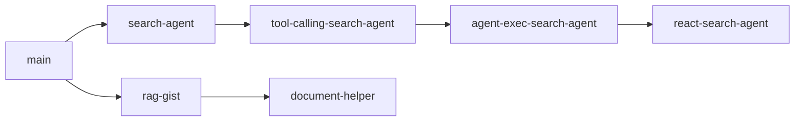

# LangChain Agents Course

A comprehensive hands-on course exploring LangChain concepts through progressively complex implementations. Each branch focuses on a specific topic, building from basic LLM chains to production-ready applications.

## Repository Overview

This repository contains multiple branches, each demonstrating different LangChain patterns and techniques. Start with `main` for fundamentals, then explore specialized branches based on your learning goals.

## Branch Documentation

| Branch                                                              | Topic                 | Description                                                  |
| ------------------------------------------------------------------- | --------------------- | ------------------------------------------------------------ |
| [`main`](../../tree/main)                                           | **LLM Basics**        | Foundation: OpenAI/Ollama setup, PromptTemplate, LCEL chains |
| [`search-agent`](../../tree/search-agent)                           | **Structured Output** | Agents with Pydantic schemas and Tavily search               |
| [`tool-calling-search-agent`](../../tree/tool-calling-search-agent) | **Tool Calling**      | Manual tool execution loop with callback handlers            |
| [`agent-exec-search-agent`](../../tree/agent-exec-search-agent)     | **ReAct Pattern**     | ReAct agent with scratchpad and output parsing               |
| [`react-search-agent`](../../tree/react-search-agent)               | **AgentExecutor**     | Production ReAct with AgentExecutor and LCEL                 |
| [`rag-gist`](../../tree/rag-gist)                                   | **RAG Fundamentals**  | Pinecone vector store, embeddings, retrieval chains          |
| [`document-helper`](../../tree/document-helper)                     | **Full Application**  | Streamlit UI, Tavily crawling, agent-based QA                |

## Learning Path



### Recommended Order

1. **`main`** - Start here to understand basic LangChain setup and LCEL
2. **`search-agent`** - Learn structured outputs with Pydantic
3. **`tool-calling-search-agent`** - Understand the internals of tool calling
4. **`agent-exec-search-agent`** - Deep dive into ReAct pattern
5. **`react-search-agent`** - Use high-level AgentExecutor
6. **`rag-gist`** - Learn RAG with vector stores
7. **`document-helper`** - Build a complete application

## Accessing Branch Documentation

Each branch contains its own `README.md` with:

- Purpose and overview
- Key features and code examples
- File structure
- Design decisions
- Comparison with other branches

To access a branch's documentation:

```bash
git checkout <branch-name>
cat README.md
```

Or view directly on GitHub: `https://github.com/AgusMattiussi/langchain-agents-course/tree/<branch-name>`

## Prerequisites

- Python 3.11+
- [uv](https://docs.astral.sh/uv/) package manager
- OpenAI API key
- Tavily API key (for search branches)
- Pinecone API key (for RAG branches)

## Quick Start

```bash
# Clone and navigate
git clone https://github.com/AgusMattiussi/langchain-agents-course.git
cd langchain_course

# Install dependencies
uv sync

# Set environment variables

# Run main branch
python main.py
```

## Technology Stack

- **LLM**: OpenAI GPT-4o-mini, Ollama (optional)
- **Search**: Tavily Search API
- **Vector Store**: Pinecone
- **Embeddings**: OpenAI text-embedding-3-small
- **Framework**: LangChain, LangChain-classic
- **UI**: Streamlit (document-helper branch)
