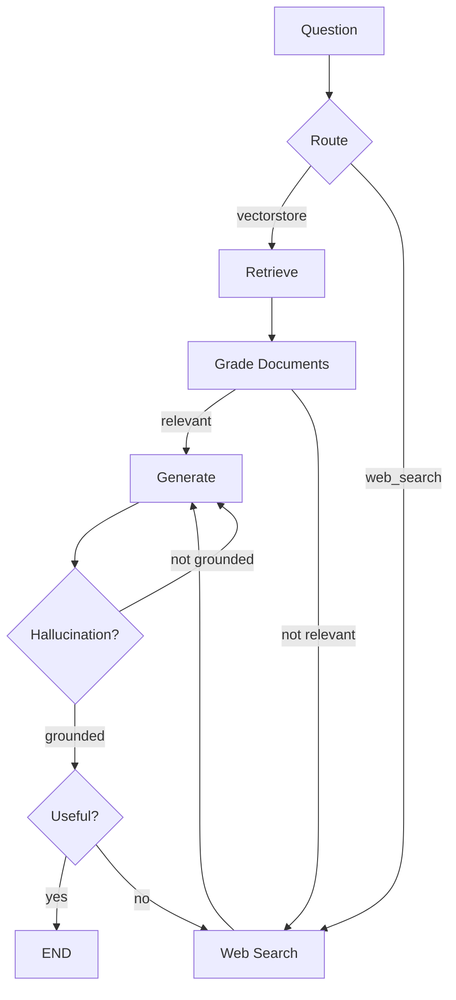

# LangChain Course - LangGraph Agentic RAG Branch

## Overview

This branch implements **Agentic RAG** using LangGraph - an advanced retrieval system with intelligent routing, document grading, hallucination checking, and self-corrective generation.

## Purpose

Demonstrate production-grade Agentic RAG:

- **Adaptive routing** between vector store and web search
- **Document relevance grading** to filter retrieved content
- **Hallucination detection** for generation quality
- **Answer grading** to ensure question relevance
- **Self-corrective loops** for improved outputs

## Architecture

### Graph State (`graph/state.py`)

```python
class GraphState(TypedDict):
    question: str       # User question
    generation: str     # LLM generation
    web_search: bool    # Whether to include web search
    documents: List[str]  # Retrieved documents
```

### Nodes (`graph/nodes/`)

- **retrieve**: Fetch documents from Chroma vector store
- **grade_documents**: Filter relevant documents
- **generate**: Generate answer from context
- **web_search**: Tavily search fallback

### Chains (`graph/chains/`)

- **router**: Route question to vectorstore or web search
- **retrieval_grader**: Grade document relevance
- **hallucination_grader**: Check if generation is grounded
- **answer_grader**: Check if answer addresses question
- **generation**: RAG prompt from LangChain Hub

## Execution Flow



## File Structure

```
├── main.py               # Entry point
├── ingestion.py          # Document loading + Chroma indexing
├── graph/
│   ├── graph.py          # LangGraph workflow definition
│   ├── state.py          # GraphState TypedDict
│   ├── consts.py         # Node name constants
│   ├── nodes/            # Node implementations
│   │   ├── retrieve.py
│   │   ├── grade_documents.py
│   │   ├── generate.py
│   │   └── web_search.py
│   └── chains/           # LLM chains
│       ├── router.py
│       ├── retrieval_grader.py
│       ├── hallucination_grader.py
│       ├── answer_grader.py
│       └── generation.py
└── graph.png             # Generated flow visualization
```

## Key Design Decisions

1. **Conditional Entry Point**: Routes questions before retrieval
2. **Multi-Stage Grading**: Documents → Hallucination → Answer relevance
3. **Self-Correction**: Re-generates on hallucination, web search on irrelevance
4. **Chroma Persistence**: Local vector store for fast retrieval
5. **LangChain Hub Integration**: Uses `rlm/rag-prompt` for generation

## Getting Started

```bash
uv sync
# Configure .env with OPENAI_API_KEY and TAVILY_API_KEY
python ingestion.py  # Index documents first
python main.py
```

## Differences from Other Branches

| Compared To                 | Difference                                 |
| --------------------------- | ------------------------------------------ |
| `rag-gist`                  | Adds grading, routing, and self-correction |
| `langgraph-reflexion-agent` | RAG vs iterative answer refinement         |
| `document-helper`           | Agentic flow vs simple retrieval chain     |
