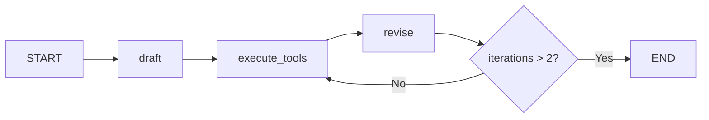

# LangChain Course - LangGraph Reflexion Agent Branch

## Overview

This branch implements the **Reflexion** pattern using LangGraph - an advanced self-improving agent that drafts answers, researches with tools, and iteratively revises based on critique.

## Purpose

Demonstrate the Reflexion agent architecture:

- **Draft → Execute → Revise** cycle with tool augmentation
- **Structured output** with Pydantic schemas for self-critique
- **Search query generation** based on identified gaps
- **Citation-backed revisions** with references

## Features

### Pydantic Schemas (`schemas.py`)

Structured output with built-in reflection:

```python
class AnswerQuestion(BaseModel):
    answer: str  # ~250 word detailed answer
    reflection: Reflection  # Missing + superfluous critique
    search_queries: List[str]  # 1-3 queries for improvement

class ReviseAnswer(AnswerQuestion):
    references: List[str]  # Citations for verification
```

### Actor Chains (`chains.py`)

- **first_responder**: Generates initial answer with self-critique
- **revisor**: Improves answer using research results and citations

### Tool Executor (`tool_executor.py`)

Executes generated search queries via Tavily:

```python
execute_tools = ToolNode([
    StructuredTool.from_function(run_queries, name=AnswerQuestion.__name__),
    StructuredTool.from_function(run_queries, name=ReviseAnswer.__name__),
])
```

### Graph Flow (`main.py`)

```python
builder.add_edge(START, "draft")
builder.add_edge("draft", "execute_tools")
builder.add_edge("execute_tools", "revise")
builder.add_conditional_edges("revise", event_loop, ["execute_tools", END])
```

## Execution Flow



## File Structure

```
├── main.py           # LangGraph Reflexion flow
├── chains.py         # First responder + revisor chains
├── schemas.py        # AnswerQuestion, ReviseAnswer schemas
├── tool_executor.py  # Tavily search tool execution
├── flow.png          # Generated graph visualization
└── pyproject.toml
```

## Key Design Decisions

1. **Reflexion Pattern**: Self-critique drives targeted research
2. **Tool Choice Forcing**: `tool_choice="AnswerQuestion"` ensures structured output
3. **Iteration Limit**: MAX_ITERATIONS=2 prevents infinite loops
4. **Citation Requirements**: Revised answers must include references

## Getting Started

```bash
uv sync
# Configure .env with OPENAI_API_KEY and TAVILY_API_KEY
python main.py
```

## Differences from Other Branches

| Compared To                  | Difference                         |
| ---------------------------- | ---------------------------------- |
| `langgraph-reflection-agent` | Adds tool execution for research   |
| `langgraph-agent-executor`   | Reflexion vs ReAct pattern         |
| `rag-gist`                   | Dynamic search vs static retrieval |
