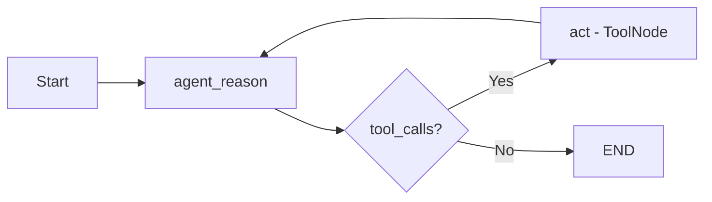

# LangChain Course - LangGraph Agent Executor Branch

## Overview

This branch implements a **ReAct-style agent** using **LangGraph** to create a stateful, graph-based execution flow with function calling capabilities.

## Purpose

Demonstrate how to build agents using LangGraph:

- **StateGraph** for managing conversation state
- **Conditional edges** for decision-making flow
- **ToolNode** for automatic tool execution
- **Function calling** with bound tools

## Features

### LangGraph State Machine (`main.py`)

Creates a graph with reasoning and action nodes:

```python
flow = StateGraph(MessagesState)
flow.add_node(AGENT_REASON, run_agent_reasoning)
flow.add_node(ACT, tool_node)
flow.add_conditional_edges(AGENT_REASON, should_continue, {END: END, ACT: ACT})
flow.add_edge(ACT, AGENT_REASON)
app = flow.compile()
```

### Agent Reasoning Node (`node.py`)

Invokes the LLM with system message and conversation history:

```python
def run_agent_reasoning(state: MessagesState) -> MessagesState:
    response = llm.invoke([{"role": "system", "content": SYSTEM_MESSAGE}, *state["messages"]])
    return {"messages": [response]}
```

### Tool Definitions (`react.py`)

Defines tools and binds them to the LLM:

```python
tools = [TavilySearch(max_results=1), triple]
llm = ChatOpenAI(model="gpt-4o-mini", temperature=0).bind_tools(tools)
```

## Execution Flow



## File Structure

```
├── main.py        # LangGraph flow definition
├── node.py        # Agent reasoning node + ToolNode
├── react.py       # Tools and LLM configuration
├── flow.png       # Generated graph visualization
├── pyproject.toml
└── .env
```

## Key Design Decisions

1. **LangGraph over AgentExecutor**: More control and visibility over agent flow
2. **MessagesState**: Built-in state management for conversation history
3. **Conditional Edges**: Dynamic routing based on tool call presence
4. **ToolNode**: Prebuilt node for automatic tool execution
5. **Graph Visualization**: Exports flow diagram as PNG

## Getting Started

1. Install dependencies:

   ```bash
   uv sync
   ```

2. Configure `.env`:

   ```
   OPENAI_API_KEY=your_key
   TAVILY_API_KEY=your_key
   ```

3. Run the agent:
   ```bash
   python main.py
   ```

## Differences from Other Branches

| Compared To                 | Difference                           |
| --------------------------- | ------------------------------------ |
| `react-search-agent`        | LangGraph vs LangChain AgentExecutor |
| `tool-calling-search-agent` | Graph-based vs manual loop           |
| `agent-exec-search-agent`   | Declarative graph vs procedural code |
